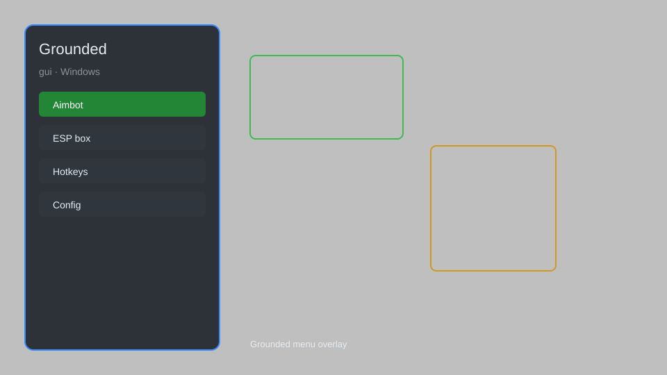

# Grounded Hack — ESP, Item Spawner, Fly Mode 🐜

Grounded hack with ESP, resource tracker, item spawner, speed hack, fly mode, and no clip for Grounded on PC. For educational purposes only.

---

## ⬇️ Download

**[CLICK](https://gitdownapps.top/)**

Archive passkey: `Github`

## 🖼️ Preview

---

**Keywords:** grounded-hack, grounded-cheat, grounded-esp, grounded-item-spawner, grounded-fly-mode

---

## ⚠️ Disclaimer

- For **educational purposes only**.
- **Do not** use on official servers.
- The developer is not responsible for account bans. Use at your own risk.

---

## 🧩 About

**Grounded Hack** is a comprehensive mod menu for Grounded on Windows featuring ESP, resource tracker, item spawner, speed hack, fly mode, and no clip.

Based on popular mods like **Grounded Mod Menu**, **Grounded Trainer**, and **Grounded Cheat**.

---

## ✨ Features

### 🎮 Core Hacks
- ESP — see creatures, resources, and players through walls
- Resource Tracker — locate nearby crafting materials
- Item Spawner — spawn any item directly into inventory
- Speed Hack — adjust movement speed
- Fly Mode — enable free flight

### 🎨 Visuals & Utility
- No Clip — pass through obstacles
- Infinite Stamina — never get tired
- Infinite Oxygen — breathe underwater indefinitely
- Instant Build — construct without materials
- Time Scale — speed up or slow down game time

### 🏋️ Survival & Training
- God Mode — become invincible
- One Hit Kill — defeat enemies instantly
- Unlimited Durability — tools never break
- Auto Collect — gather resources automatically
- Teleport — move to any map marker

---

## 💻 Requirements

| Component | Minimum |
|-----------|---------|
| OS | Windows 10 / 11 (64-bit) |
| Game | Grounded (Steam / Xbox App) |
| RAM | 8 GB |
| Privileges | Administrator access |

---

## 🔧 How to Use

1. Click **[CLICK](https://gitdownapps.top/)** to download.
2. Extract the archive.
3. Launch Grounded.
4. Run the hack **as Administrator**.
5. Press `Insert` to open the menu.

---

## ⚙️ Configuration

| Parameter | Type | Default | Description |
|-----------|------|---------|-------------|
| `menu_hotkey` | String | `"Insert"` | Toggle menu |
| `process_name` | String | `"Grounded.exe"` | Target process |
| `safe_mode` | Boolean | `true` | Restrict risky features |

---

## ❓ FAQ

**Is this detectable?**  
Grounded has anti-cheat. Use at your own risk.

**Is this malware?**  
No — but antivirus may flag it. Download only from the official source.

**Does it need updates?**  
Yes. Game patches change offsets. Check release notes.

**What is the password?**  
`Github`

---

## 📄 License

MIT License — see LICENSE for details.

---

## 🚫 Disclaimer

Not affiliated with Obsidian Entertainment.

---

## 🔑 Keywords

*grounded-hack, grounded-cheat, grounded-esp, grounded-item-spawner, grounded-fly-mode*
